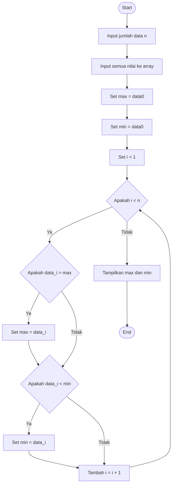

```mermaid
flowchart TD
    A([Start]) --> B[Input jumlah data n]
    B --> C[Input semua nilai ke array]
    C --> D[Set max = data0]
    D --> E[Set min = data0]
    E --> F[Set i = 1]

    F --> G{Apakah i < n}

    G -->|Ya| H{Apakah data_i > max}
    H -->|Ya| I[Set max = data_i]
    H -->|Tidak| J{Apakah data_i < min}

    I --> J
    J -->|Ya| K[Set min = data_i]
    J -->|Tidak| L[Tambah i = i + 1]

    K --> L
    L --> G

    G -->|Tidak| M[Tampilkan max dan min]
    M --> N([End])
```