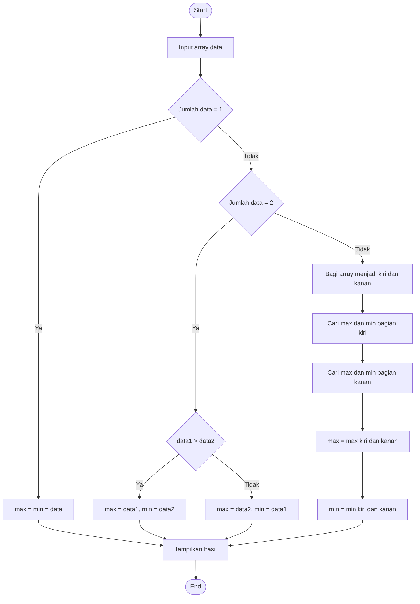

```mermaid
flowchart TD
    A([Start]) --> B[Input array data]
    B --> C{Jumlah data = 1}

    C -->|Ya| D[max = min = data]
    C -->|Tidak| E{Jumlah data = 2}

    E -->|Ya| F{data1 > data2}
    F -->|Ya| G[max = data1, min = data2]
    F -->|Tidak| H[max = data2, min = data1]

    E -->|Tidak| I[Bagi array menjadi kiri dan kanan]
    I --> J[Cari max dan min bagian kiri]
    J --> K[Cari max dan min bagian kanan]

    K --> L[max = max kiri dan kanan]
    L --> M[min = min kiri dan kanan]

    G --> N[Tampilkan hasil]
    H --> N
    D --> N
    M --> N

    N --> O([End])
```